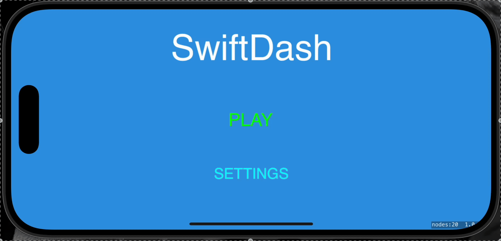
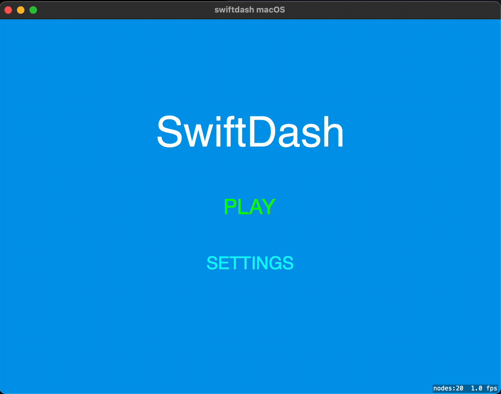

# SwiftDash 🐦‍⬛

A Swift port of the terminal game GopherDash, built with SpriteKit for macOS and iOS.

## About

SwiftDash is an endless runner game where you control a hamster that runs right while the world scrolls left. Jump over rocks and holes to survive as long as possible and beat your high score! The game features a comprehensive menu system, customizable settings, and polished cross-platform gameplay.

## Screencast




## Features

### Game Features
- **Endless Runner Gameplay**: Keep running and jumping over obstacles
- **Progressive Difficulty**: Game speed increases gradually over time  
- **Responsive Layout**: Scales perfectly across all screen sizes and orientations
- **Smooth Physics**: Realistic gravity and collision system

### Menu & Navigation System
- **Main Menu**: Professional title screen with play and settings options
- **Settings Menu**: Volume control (0-100%) and high score management
- **In-Game Menu**: Return to main menu anytime during gameplay
- **Smart Navigation**: Seamless transitions between game states

### Cross-Platform Excellence
- **macOS**: Resizable windows, mouse and keyboard support
- **iOS**: Landscape-optimized, touch and gesture controls
- **Responsive UI**: Safe area handling for notches and home indicators
- **Memory Management**: Clean state transitions and world cleanup

### User Experience
- **High Score System**: Persistent scores with reset functionality
- **Volume Control**: Adjustable game audio with visual slider
- **Confirmation Dialogs**: "This cannot be undone!" safety prompts
- **Visual Feedback**: Button highlights and smooth animations

## How to Play

### Starting the Game
1. **Launch**: Run the app and you'll see the main menu
2. **Navigate**: Tap/click "PLAY" to start or "SETTINGS" to customize
3. **Settings**: Adjust volume or reset high score (with confirmation)

### Gameplay Controls
**macOS**:
- **Jump**: `Space`, `W`, or click anywhere
- **Menu**: Click "Menu" button or press `Escape`
- **Quit**: Press `Q` anytime

**iOS**:
- **Jump**: Tap anywhere on screen  
- **Menu**: Tap "Menu" button in top-left during gameplay
- **Back Navigation**: Swipe from left edge of screen (standard iOS gesture)

### Game Mechanics
1. **Objective**: Run as far as possible by jumping over obstacles
2. **Obstacles**:
   - **Rocks** (gray): Jump over them when on the ground
   - **Holes** (black): Jump over them to avoid falling
3. **Scoring**: Distance increases every frame, speed ramps up gradually
4. **Game Over**: Hit an obstacle, see your score, wait 2 seconds to restart

### Menu Navigation
- **During Game**: Tap "Menu" button (top-left) or swipe from left edge (iOS)
- **Settings Access**: From main menu, tap "SETTINGS"
- **Volume Control**: Drag slider or tap on slider track
- **High Score Reset**: Tap "Reset High Score" → confirm with "YES"
- **Back Navigation**: "BACK" button or `Escape` key (macOS)

## Building and Running

### Prerequisites
- Xcode 15.0 or later
- macOS 14.0 or later (for building)
- iOS 17.0 or later (for iOS target)

### Build Instructions

1. **Open the project**:
   ```bash
   open swiftdash.xcodeproj
   ```

2. **Select target**:
   - For macOS: Select "swiftdash macOS" scheme
   - For iOS: Select "swiftdash iOS" scheme

3. **Build and run**:
   - Press `Cmd+R` or click the Run button
   - For iOS, you'll need a simulator or connected device

### Command Line Build Scripts

For quick building and testing without opening Xcode, you can use the included bash scripts:

#### macOS Version
```bash
./build_and_run_mac.sh
```
This script will:
- Build the macOS app using xcodebuild
- Copy the built `.app` to `build/Debug/swiftdash.app` for easy access
- Launch the app automatically

#### iOS Version
```bash
./build_and_run_ios.sh
```
This script will:
- Build the iOS app using xcodebuild
- Copy the built `.app` to `build/Debug-iphonesimulator/swiftdash.app`
- Install and launch the app in the iOS Simulator
- Open the Simulator app for interaction
- Provide manual orientation instructions for landscape mode

#### Prerequisites for Scripts
- Xcode command line tools must be set as active:
  ```bash
  sudo xcode-select --switch /Applications/Xcode.app/Contents/Developer
  ```
- For iOS: At least one iOS Simulator device must be available

#### Benefits of Using Scripts
- **Fast iteration**: No need to open Xcode for testing
- **Easy sharing**: Built apps are in local `build/` directory
- **Automated workflow**: One command to build and run
- **CI/CD friendly**: Can be integrated into automated build processes

### Project Structure

```
swiftdash/
├── swiftdash Shared/          # Shared game code
│   ├── GameScene.swift        # Main game logic and menu system
│   └── Assets.xcassets/       # Game assets and graphics
├── swiftdash macOS/           # macOS-specific code
│   └── GameViewController.swift
├── swiftdash iOS/             # iOS-specific code  
│   └── GameViewController.swift (landscape-only)
└── swiftdash.xcodeproj/       # Xcode project
```

## Game Architecture

### State Management
- **Main Menu**: Title screen with navigation options
- **Settings**: Volume control and high score management  
- **Playing**: Active gameplay with distance tracking
- **Game Over**: Score display with restart countdown
- **Cooldown**: Prevents accidental restarts

### Responsive Layout System
- **Safe Area Support**: Automatic iOS notch/indicator handling
- **Platform Adaptation**: Different margins and spacing for iOS vs macOS
- **Dynamic Scaling**: UI elements scale with screen size
- **Orientation Lock**: iOS forces landscape for optimal experience

### Memory Management
- **State Cleanup**: Proper removal of game world when returning to menu
- **Node Management**: Efficient obstacle spawning and removal
- **Asset Loading**: Optimized texture and sprite handling

## Settings & Persistence

### Local Storage
**High Scores**: `~/Documents/.swiftdash_highscore`
**Settings**: `~/Documents/.swiftdash_settings`

### Settings Features
- **Volume Control**: 0-100% with visual slider and instant feedback
- **High Score Reset**: Secure deletion with "This cannot be undone!" confirmation
- **Persistent Storage**: Settings survive app restarts

## Platform-Specific Features

### macOS
- **Window Resizing**: Responsive layout adapts to any window size
- **Keyboard Shortcuts**: `Space`, `W` for jump, `Q` for quit, `Escape` for menu navigation
- **Mouse Support**: Click anywhere to jump, click buttons for menu navigation

### iOS  
- **Landscape Optimization**: Forced landscape orientation for best endless runner experience
- **Touch Controls**: Tap to jump, tap buttons for menu navigation
- **iOS Gestures**: Left-edge swipe for system-standard back navigation
- **Safe Areas**: Automatic handling of notches, home indicators, and dynamic islands

## Controls Reference

| Action | macOS | iOS |
|--------|-------|-----|
| Jump | Space, W, Click | Tap screen |
| Menu (in-game) | Click "Menu" or Escape | Tap "Menu" or swipe from left edge |
| Settings | Click "SETTINGS" | Tap "SETTINGS" |
| Back | Click "BACK" or Escape | Tap "BACK" or swipe from left edge |
| Quit App | Q | System gestures |
| Volume | Click/drag slider | Tap/drag slider |

## Development Notes

This is a Swift port of the original Go terminal game [GopherDash](https://github.com/krisfur/gopherdash). The game has been significantly enhanced with a full menu system, settings, and platform-specific optimizations while maintaining the core endless runner gameplay.

### Key Enhancements from Terminal Version
- **Complete Menu System**: Professional UI with main menu, settings, and navigation
- **Cross-Platform Input**: Mouse, keyboard, touch, and gesture support
- **Responsive Design**: Scales across all screen sizes and orientations
- **Settings Management**: Volume control and persistent high score system
- **Memory Management**: Proper cleanup and state management
- **Platform Optimization**: iOS landscape lock, macOS window resizing, safe area handling

### Technical Architecture
- **SpriteKit Framework**: Modern 2D graphics and animation
- **State-Driven Design**: Clean separation of menu, game, and settings states
- **Responsive Layout**: Percentage-based positioning with safe area support
- **Asset Management**: Organized sprite and texture loading system

## License

MIT © 2025 Krzysztof Furman

## Original Game

This is an enhanced port of [GopherDash](https://github.com/krisfur/gopherdash), a terminal-based endless runner written in Go using Bubble Tea. 